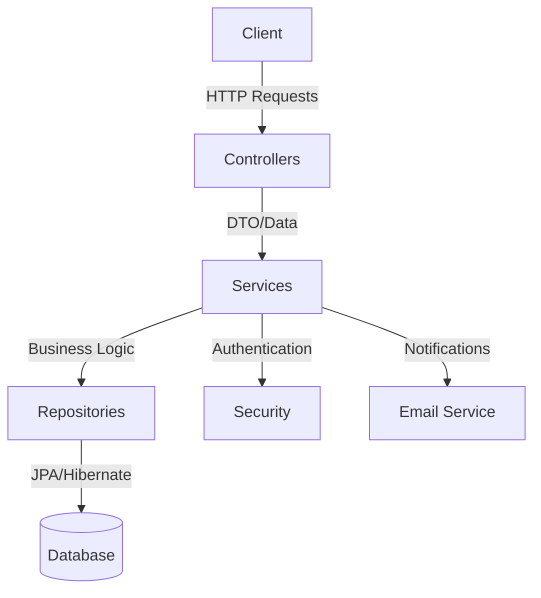
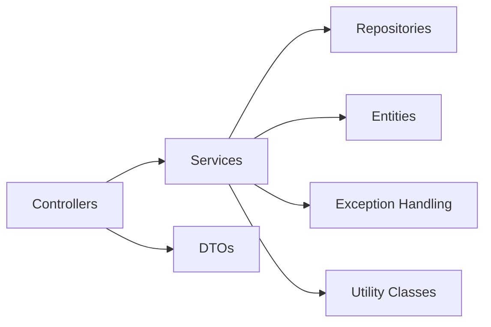
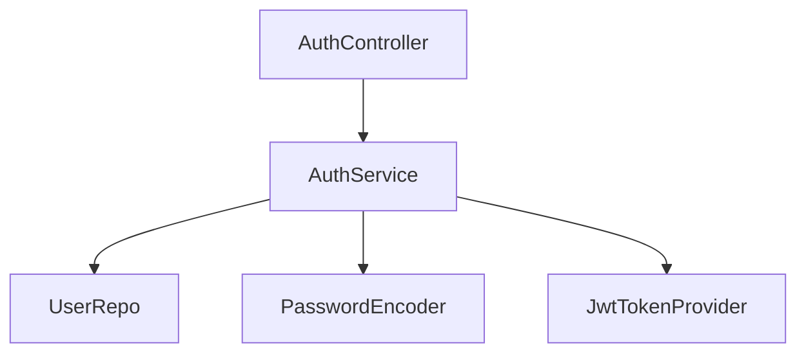
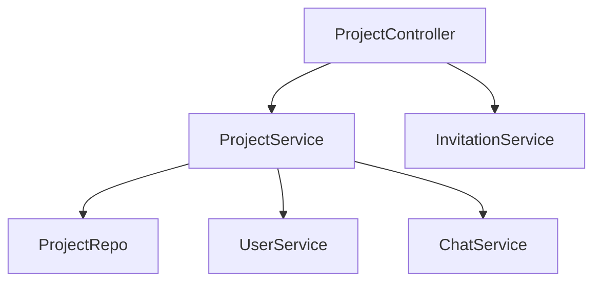
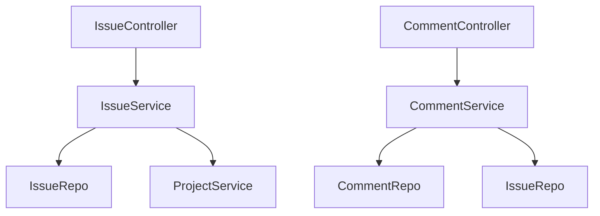
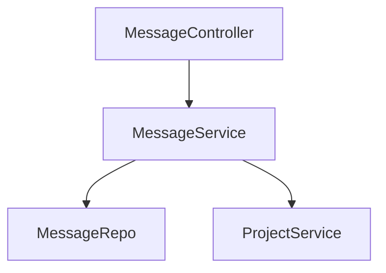
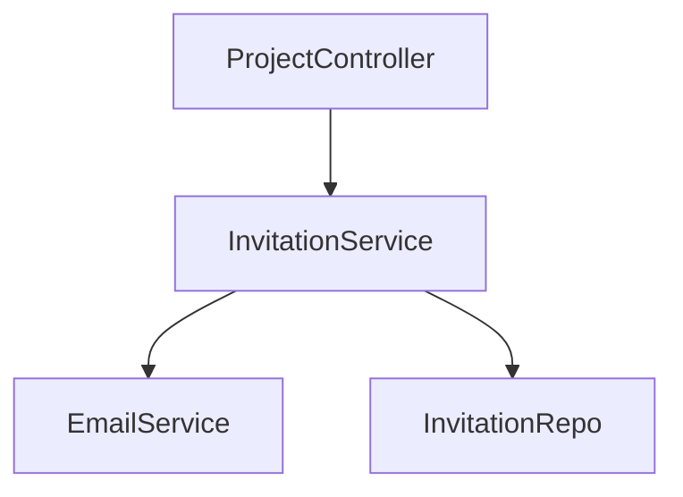
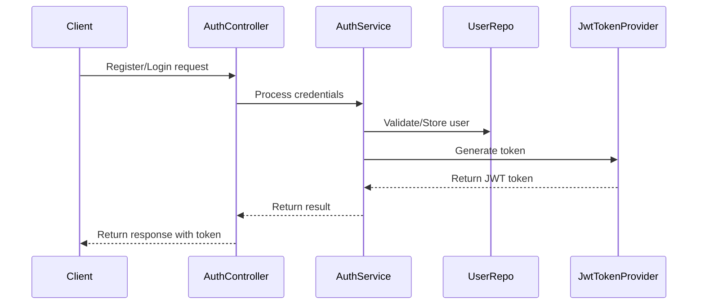
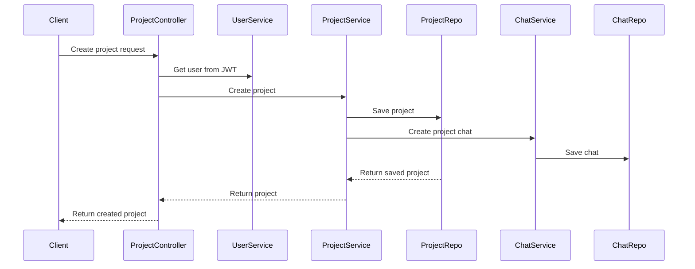
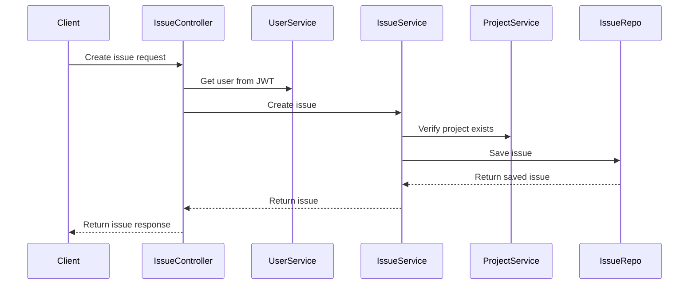

 GoHaibo - Project Management Application

## Overview

GoHaibo is a comprehensive project management system built with Spring Boot. It enables teams to collaborate effectively through features like project creation and management, issue tracking, team communication via chat, and member invitation through email.

## Architecture

The application follows a classic layered architecture pattern with clear separation of concerns:



### Core Components



## Module Structure

### Authentication Module
Handles user registration, login, and JWT token management.



### Project Management Module
Manages project creation, updates, searches, and team management.



### Issue Tracking Module
Handles issue creation, assignment, status updates, and comments.



### Chat Module
Enables team communication within projects.



### Invitation Module
Manages sending and accepting project invitations.



## Information Flow

### Authentication Flow



### Project Creation Flow



### Issue Management Flow



## Setup Instructions

### Prerequisites
- Java 21
- Maven
- MySQL database

### Configuration
1. Clone the repository
2. Create a `.env` file in the root directory based on .env.example:

```properties
# Database credentials
DB_HOST=localhost
DB_PORT=3306
DB_NAME=gohaibo
DB_USERNAME=your_username
DB_PASSWORD=your_password

# HMAC secret key (generate a strong one)
JWT_SECRET_KEY=your_secure_base64_encoded_key
JWT-EXPIRATION-TIME=604800000  # 7 days in milliseconds

# Email configuration (for invitations)
spring.mail.host=smtp.gmail.com
spring.mail.port=587
spring.mail.username=your_email@gmail.com
spring.mail.password=your_email_app_password
spring.mail.properties.mail.smtp.auth=true
spring.mail.properties.mail.smtp.starttls.enable=true
```

### Running the Application

#### Using Maven
```bash
./mvnw spring-boot:run
```

#### Using Java
```bash
./mvnw clean package
java -jar target/gohaibo-0.0.1-SNAPSHOT.jar
```

### API Documentation

The API provides endpoints for:
- Authentication (`/auth/*`)
  - Registration
  - Login
- User Management (`/api/users/*`)
  - User profile retrieval
- Project Management (`/api/projects/*`)
  - CRUD operations
  - Team management
  - Project search and filtering
- Issue Tracking (`/api/issues/*`)
  - CRUD operations
  - Status updates
  - Assignee management
- Comments (`/api/comments/*`)
  - Adding and retrieving comments on issues
- Chat Messages (`/api/message/*`)
  - Sending and retrieving messages

## Technologies Used

- **Spring Boot 3.4.1**: Core framework
- **Spring Security**: Authentication and authorization
- **Spring Data JPA**: Data access and persistence
- **MySQL**: Primary database
- **H2**: Testing database
- **JWT**: Authentication tokens
- **Lombok**: Boilerplate code reduction
- **Spring Mail**: Email notifications
- **JUnit 5**: Testing framework
- **Mockito**: Mocking framework for tests

## Project Structure

```
src/
  main/
    java/com/gohaibo/gohaibo/
      config/            # Security configuration and JWT validation
      controller/        # API endpoints
      controlleradvice/  # Global exception handlers
      dto/               # Data transfer objects
      entity/            # JPA entities
      exception/         # Custom exceptions
      repo/              # Data repositories
      service/           # Service interfaces
      serviceimp/        # Service implementations
      utility/           # Helper classes
    resources/
      application.properties  # Application configuration
  test/
    java/com/gohaibo/gohaibo/
      # Test classes organized by module
    resources/
      application.properties  # Test configuration
